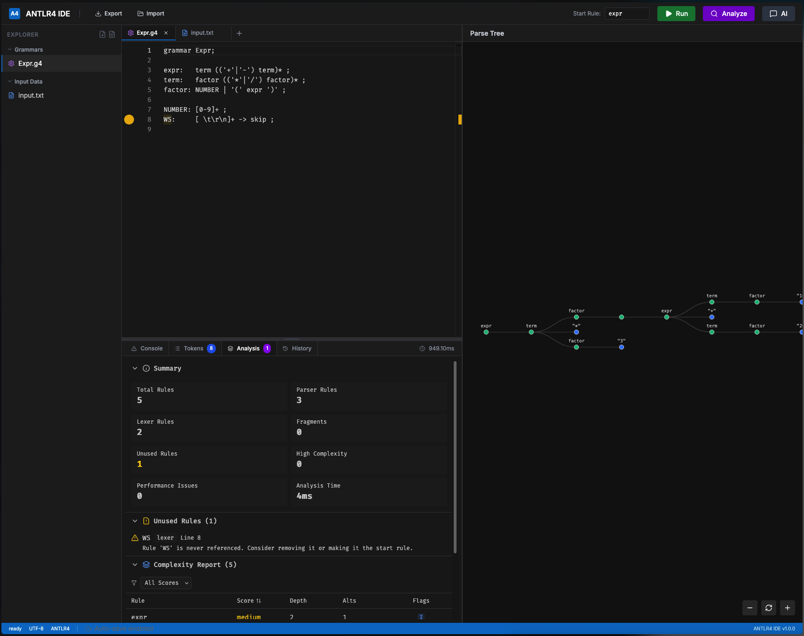

# ANTLR4 IDE

A modern, web-based IDE for experimenting with ANTLR4 grammars. Write grammar files, test them against input text, and visualize parse trees in real-time.



## Features

- 📝 **Monaco Editor** - Full-featured code editor with ANTLR4 syntax highlighting
- 🌳 **Interactive Parse Tree Visualization** - D3-based tree rendering with zoom/pan controls
- 🔍 **Real-time Error Detection** - Grammar validation and parsing errors displayed instantly
- 💾 **Project Management** - Save and load entire projects as JSON files
- 📦 **Multiple Files** - Support for multiple grammar files and input files
- 🎨 **VS Code-inspired UI** - Familiar IDE interface with resizable panels
- 🚀 **No Build Required** - Works entirely in the browser using ANTLR4 JavaScript runtime

## Quick Start

### Prerequisites

- Node.js 18+
- npm or yarn

### Installation

```bash
# Clone the repository
git clone <your-repo-url>
cd antlr4-ide

# Install dependencies
npm install

# Start the development server
npm run dev
```

The application will be available at `http://localhost:3000`

### Building for Production

```bash
npm run build
```

The production build will be created in the `dist/` directory.

### Running with Docker

```bash
# Build the Docker image
docker build -t antlr4-ide .

# Run the container
docker run -p 8080:80 antlr4-ide
```

Or use Docker Compose:

```bash
# Start the application
docker-compose up -d

# Stop the application
docker-compose down
```

The application will be available at `http://localhost:8080`

## Usage

### Creating a Grammar

1. Click the **Grammar** icon (⚙️) in the sidebar to create a new grammar file
2. Write your ANTLR4 grammar using standard syntax:

```antlr
grammar Expr;

expr:   term (('+'|'-') term)* ;
term:   factor (('*'|'/') factor)* ;
factor: NUMBER | '(' expr ')' ;

NUMBER: [0-9]+ ;
WS:     [ \t\r\n]+ -> skip ;
```

### Adding Input Text

1. Click the **Text** icon (📄) in the sidebar to create a new input file
2. Enter text to parse:

```
(10 + 20) * 3
```

### Running the Parser

1. Set the **Start Rule** in the header (e.g., `expr`)
2. Click the **Run** button
3. View the results:
   - **Console tab**: Errors and warnings
   - **Tokens tab**: Lexer token stream
   - **Parse Tree panel**: Visual representation of the parse tree

### Managing Files

- **Rename**: Double-click a file or click the edit icon
- **Delete**: Click the trash icon (requires at least 1 file to remain)
- **Save Project**: Click the **Save** button to download as JSON
- **Load Project**: Click the **Open** button to load a saved project

## Project Structure

```
src/
├── components/          # React components
│   ├── CodeEditor.tsx   # Monaco editor wrapper
│   └── TreeVisualizer.tsx  # D3 parse tree visualization
├── types/               # TypeScript type definitions
├── utils/
│   └── antlr/           # ANTLR4 runtime implementation
│       ├── index.ts     # Main parsing orchestration
│       ├── GrammarLoader.ts  # Grammar file parser
│       ├── Validation.ts     # Grammar validation
│       ├── LexerAdaptor.ts   # Runtime lexer
│       ├── ParserAdaptor.ts  # Runtime parser
│       └── types.ts          # ANTLR4-specific types
├── App.tsx              # Main application component
└── main.tsx             # Application entry point
```

## Technology Stack

- **React 19** - UI framework
- **TypeScript 5.8** - Type safety
- **Vite 6** - Build tool and dev server
- **Monaco Editor** - Code editor (same as VS Code)
- **D3.js 7** - Parse tree visualization
- **ANTLR4 4.13.2** - Parser runtime
- **Lucide React** - Icon library
- **Tailwind CSS** - Styling

## Development

### Available Scripts

- `npm run dev` - Start development server
- `npm run build` - Build for production
- `npm run preview` - Preview production build
- `npm run type-check` - Run TypeScript type checking
- `npm run lint` - Run ESLint

### Type Checking

The project uses strict TypeScript configuration. Run type checking with:

```bash
npm run type-check
```

### Code Style

ESLint is configured for code quality. Run linting with:

```bash
npm run lint
```

## Configuration

### Vite Configuration

The Vite configuration (`vite.config.ts`) includes:
- React plugin for JSX support
- Path alias `@/` pointing to `src/`
- Development server on port 3000 (configurable)

### TypeScript Configuration

The TypeScript configuration (`tsconfig.json`) uses:
- Strict type checking enabled
- Path mapping for `@/*` imports
- ES2022 target with DOM libraries

## Grammar Validation

The application validates ANTLR4 grammars for:
- **Undefined rule references** - Parser rules referencing non-existent rules
- **Undefined token references** - References to tokens not defined in lexer
- **Direct left-recursion** - Simple cases of left-recursive rules

## Parse Tree Visualization

The parse tree visualizer features:
- **Horizontal layout** - Left-to-right tree structure
- **Color coding**:
  - 🟢 Green nodes: Parser rules
  - 🔵 Blue nodes: Tokens
  - 🔴 Red nodes: Errors
- **Interactive controls**:
  - Click nodes to select tokens
  - Zoom in/out with + and - buttons
  - Reset view with refresh button
  - Pan by dragging the canvas

## Known Limitations

- Complex left-recursion detection is basic
- Fragment expansion limited to 10 levels
- Large grammars may impact performance
- Browser-based only (no command-line usage)

## Troubleshooting

### Build Errors

If you encounter build errors:
1. Clear node_modules: `rm -rf node_modules package-lock.json`
2. Reinstall: `npm install`
3. Rebuild: `npm run build`

### Type Errors

If TypeScript errors persist:
1. Run type check: `npm run type-check`
2. Check import paths use `@/` alias
3. Verify all files are in `src/` directory

### Runtime Errors

If the parser fails:
1. Check grammar syntax in the console
2. Verify start rule name is correct
3. Ensure at least one grammar and input file exist

## Contributing

Contributions are welcome! Please:
1. Fork the repository
2. Create a feature branch
3. Make your changes
4. Run tests and type checking
5. Submit a pull request

## License

This project is licensed under the MIT License.

## Acknowledgments

- Built with [ANTLR4](https://www.antlr.org/) by Terence Parr
- Editor powered by [Monaco Editor](https://microsoft.github.io/monaco-editor/)
- Visualization using [D3.js](https://d3js.org/)
- UI inspired by VS Code

## Support

For issues and questions:
- Create an issue on GitHub
- Check the [ANTLR4 documentation](https://github.com/antlr/antlr4/tree/master/doc)
- Review [example grammars](https://github.com/antlr/grammars-v4)
